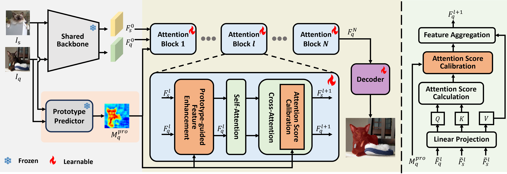
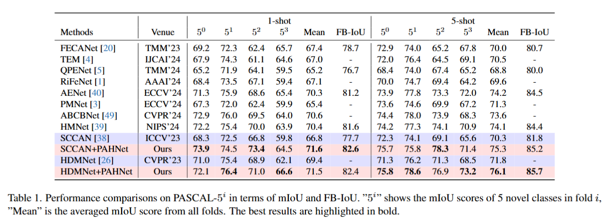
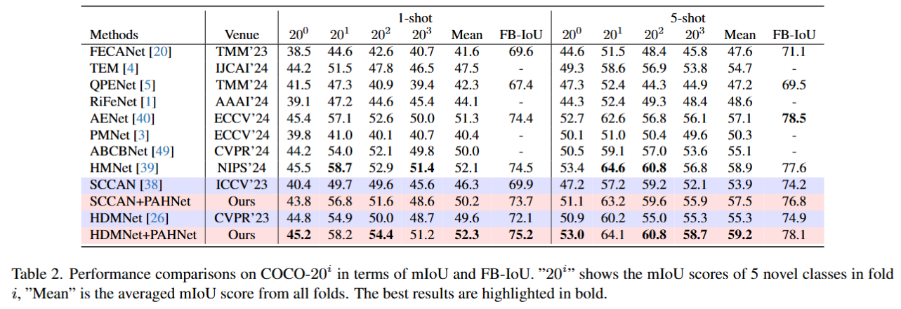

# Balancing Conservatism and Aggressiveness:Prototype-Affinity Hybrid Network for Few-Shot Segmentation, ICCV'25, Top Score(AFR = 6.00)

This repository contains the code for our work "* Balancing Conservatism and Aggressiveness:
Prototype-Affinity Hybrid Network for Few-Shot Segmentation*", 
where we design a plug-in network HPANet for two existing cross attention-based baselines: [SCCAN](https://github.com/Sam1224/SCCAN) and [HDMNet](https://github.com/Pbihao/HDMNet).

> **Abstract**: *This paper studies the few-shot segmentation (FSS) task, which aims to segment objects belonging to unseen categories in a query image by learning a model on a small number of well-annotated support samples. Our analysis of two mainstream FSS paradigms reveals that the predictions made by prototype learning methods are usually conservative, while those of affinity learning methods tend to be more aggressive. This observation motivates us to balance the conservative and aggressive information captured by these two types of FSS frameworks so as to improve the segmentation performance. To achieve this, we propose a ​**P**rototype-**A**ffinity ​**H**ybrid ​**Net**work (PAHNet), which introduces a Prototype-guided Feature Enhancement (PFE) module and an Attention Score Calibration (ASC) module in each attention block of an affinity learning model (called affinity learner). These two modules utilize the predictions generated by a pre-trained prototype learning model (called prototype predictor) to enhance the foreground information in support and query image representations and suppress the mismatched foreground-background (FG-BG) relationships between them, respectively. In this way, the aggressiveness of the affinity learner can be effectively mitigated, thereby eventually increasing the segmentation accuracy of our PAHNet method. Experimental results show that PAHNet outperforms most recently proposed methods across 1-shot and 5-shot settings on both PASCAL-5<sup>i</sup> and COCO-20<sup>i</sup> datasets, suggesting its effectiveness in solving FSS tasks.*

<p align="middle">
  
</p>

## Environment

Please follow the official guidelines of the selected baselines to create their virtual environments. Note that:
- You can follow [SCCAN](https://github.com/Sam1224/SCCAN) to create a separate environment for SCCAN_HPANet.
- You need to follow [HDMNet](https://github.com/Pbihao/HDMNet) to create a separate environment for HDMNet_HPANet.

## Directory Structure

The directory structure is:

    ../
    ├── PAHNet/             # code for PAHNet
        ├── HDMNet_PAHNet/  # code for HDMNetPlus
        ├── SCCAN_PAHNet/   # code for SCCANPlus     
        ├── lists/          # shared data lists
        ├── pretrained/     # SSP pretrained backbones
    ├── initmodel/          # shared pretrained backbones
    └── data/               # shared data
        ├── base_annotation/
        ├── VOCdevkit2012/
        │   └── VOC2012/
        └── MSCOCO2014/           
            ├── annotations/
            ├── train2014/
            └── val2014/

### Datasets

- PASCAL-5<sup>i</sup>:  [VOC2012](http://host.robots.ox.ac.uk/pascal/VOC/voc2012/) + [SBD](http://home.bharathh.info/pubs/codes/SBD/download.html)
- COCO-20<sup>i</sup>:  [COCO2014](https://cocodataset.org/#download)

We follow the lists generation as [AENet](https://github.com/Sam1224/AENet/), and the file paths in the code need to be modificated according to the datasets and checkpoints.

## Models

- Download [exp_sccan.zip](https://drive.google.com/drive/folders/1g8zJUGGMHTBBtc791a5KH-KdHyph9mXg?usp=drive_link) to obtain SCCAN_PAHNet-related pretrained models, and extract them to `SCCAN_PAHNet/exp`.
- Download [exp_hdmnet.zip](https://drive.google.com/drive/folders/1immYMKR1IncmC9QvHD6SD4CCyOVarZ42?usp=drive_link) to obtain HDMNet_PAHNet-related pretrained models, and extract them to `HDMNet_PAHNet/exp`.

## Training and Testing Commands

- Change configuration via the `.yaml` files in `config`, then run the following commands for training and testing.
- **Meta-training**
  - *1/5-shot*
  ```
  CUDA_VISIBLE_DEVICES=0 python train_SCCAN_PAHNet.py --config=config/{pascal,coco}/{5-shot}/{pascal,coco}_split{0,1,2,3}_resnet50.yaml
  ```
  
- **Meta-testing**
  - *1/5-shot*
  ```
  CUDA_VISIBLE_DEVICES=0 python test_SCCAN_PAHNet.py --config=config/{pascal,coco}/{5-shot}/{pascal,coco}_split{0,1,2,3}_resnet50.yaml
  ```

## Performance

Performance comparison with the state-of-the-arts. 

1. ### PASCAL-5<sup>i</sup>

<p align="middle">
  
</p>

2. ### COCO-20<sup>i</sup>

<p align="middle">
  
</p>

## Visualization

<p align="middle">
    
</p>

## References

This repo is mainly built based on [SSP](https://github.com/fanq15/SSP/) and [AENet](https://github.com/Sam1224/AENet/). Thanks for their great work!

## BibTeX

If you find our work and this repository useful. Please consider giving a star :star: and citation &#x1F4DA;.
